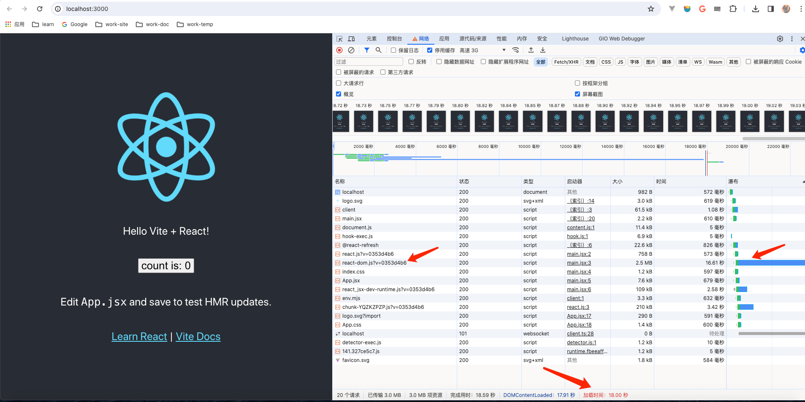
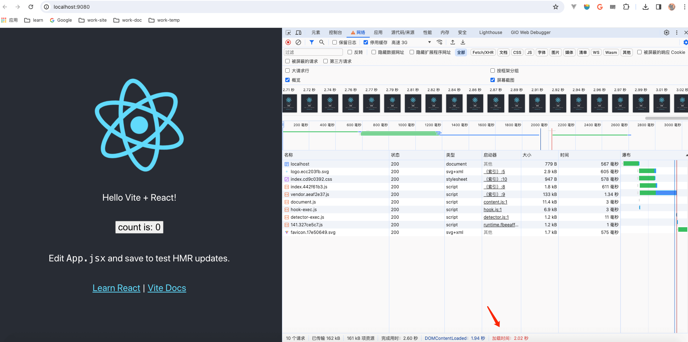

## 性能优化揭秘

## 一 第1章- 性能优化方法概述

### 1 方法1 图片预加载: 把图片请求提前，让其和请求接口 并行加载

S1 实现方法: 

```html
<head>
  <meta charset="UTF-8">
  <link rel="preload" as="image" href="imgUrl">
  <!-- 其他 <meta> -->
</head>
```

S2 效果对比:


### 2 方法2 工程化相关方法: 减少文件体积

2.1 文件打包和代码压缩 ==[实现方法]==> `npx vite build`

2.2 JS引入优化(按需引入): Tree Shaking==> todo

2.3 CSS引入优化(通过插件 模拟实现 样式按需引入)==> `vite-plugin-import`

```js
// vite.config.jss
import { defineConfig } from 'vite';
import react from '@vitejs/plugin-react';
import importPlugin from 'vite-plugin-import';
// 配置
export default defineConfig({
  plugins: [react(), importPlugin({
    babelImportPluginOptions: [
      {
        libraryName: 'antd',
        libraryDirectory: 'es',
        style: 'css',
      }
    ]
  })],
});
```

2.4 非首屏组件 延后按需引入==> `动态import`==> `Code Splitting(代码分割)`

 - 动态import本身其实并不减小文件的体积，背后实现这一点的是Vite的代码分割
 - 使用Code Splitting可以将代码分割成多个文件，并且可以在需要的时候再加载；而动态import可以告诉构建工具，代码分割的分割点在哪里


```jsx
import { useState } from 'react';
import { Button } from 'antd';

function App() {
  // Modal组件相关的逻辑, 在首屏是完全不需要的
  // 所以可以使用 动态import的方式来引入Modal组件
  // 即 仅在点击Button组件后才加载相关的模块
  const onClick = () => {
    Promise.all([
      import('antd/es/modal'),
      import('antd/es/modal/style/css'),
    ]).then(([ Modal ]) => {
      Modal.info({
        title: 'Hello World',
        onOk() {},
      });
    });
  }
  return (
    <div>
      <Button style={{ margin: '20px' }} onClick={onClick}>Hello</Button>
    </div>
  )
}
```





### 3 小结

> 即使使用网络模拟、缓存控制等功能，我们看到的性能和用户看到的性能其实仍然是完全不一样的，因为用户所处的网络环境和使用的机器设备等非常复杂。

> 所以，第2~4章主要介绍在真正的生产环境中如何评估、分析和验证用户感受到的真实性能。
> 例如，如何度量一个 在线页面的 真实的性能表现? 
> 如何分析 这个在线页面 在不同用户的机器上 运行的整体性能状况?
> 如何 从数据中找到其性能不佳的原因?
> 如何通过线上的实验手段来验证优化效果?

> 本章在本地完成的是一个简化流程，先在浏览器中查看它渲染页面的时间，然后通过DevTools的加载图分析性能较差的原最后在浏览器中测试它的优化效果。
> 与这种简化流程相因相比，在现实的生产环境中，整个流程会涉及一些 数据的采集和分析工作。

## 二 第2章- 性能优化度量标准

### 1 标准1: performance.now()

1.1 标准1: 度量 用户端的某个功能点 性能: performance.now()

S1 可以在 在关键功能后调用 performance.now()来采集和统计用户端的设备性能数据

```js
const res = await fetch(API);
const data = await res.json();
domContainer.innerHTML= data;
// 埋点记录
record(performance.now());
```

S2 相比Date.now()的优点
  - 更精确，performance.now()的单位是微秒，Date.now()的精确度是毫秒
  - Date.now值 依赖于客户端的本地时间戳，而performance.now()获取的是 页面打开时间点作为基点的 相对时间，不依赖 操作系统的时间


### 2 标准2: 用户端 整体性能水平

2.1 最常见的3个 衡量用户端整体性能水平的 统计指标:
  - 均值
  - 分位数
  - 秒开率

2.2 均值: 获取多个用户、多次访问的首屏指标 并求出其均值
  - 注意点1: 均值需要排除【极值】的影响，可以按照经验 丢弃一部分极值(如根据经验 判断>=3000ms的数据是不正常的，就在统计时抛弃这些数据)
  - 注意点2: 均值并不代表一个典型用户端的性能状况，也不能代表达到某种性能体验的用户占比(无法得知 性能情况的 各自分类的占比人群)

2.3 分位数: 如果有>=x%的用户 首屏渲染耗时达到期望值，那么就可以说有x分位树，比如中位数就是一种特定分位数，即50分位数，是一种常用的分位数指标
  - 通常将这些值称为Top Percent（TP），如 TP 90 就代表90分位数
  - 推荐使用75分位数 来确保大多数用户的体验
  - 对性能有高追求的场景，也可以采用 90~95分位数等

2.4 秒开率: 页面在 期望秒数(如1秒/2秒)内 打开的 用户占比
  - 分位数 侧重于性能差的用户端的 性能状况(下限)，而 秒开率则更关注有多少用户端可以到达非常高的性能水平(上限)

> 在条件允许的情况下，推荐使用分位数来衡量性能
> 在去掉极值的情况下，均值也存在一定的可参考性，尤其是用于衡量趋势变化及优化效果等
> 在大部分场景下并不推荐使用秒开率，但对于特定场景下的 极致性能优化可以考虑使用

### 3 标准3: 首屏度量指标

3.1 常见的 首屏度量指标
  - FP（First Paint）: 浏览器第一次在页面上 绘制的时间

  - FCP（First Contentful Paint）: 浏览器第一次绘制出DOM元素的时间，一般接近于FP值

  - FMP（First Meaningful Paint）: 第一次有意义的绘制，是一个主观性指标，指的是 我们主观认为 页面渲染 有意义的内容的 时间点
> 在一般情况下，首屏指的主要是FMP

  - TTI（Time to Interactive，可交互时间）


3.2 度量/量化  FMP的方法
  - 关键逻辑计时: 记录关键逻辑的时间点，如 页面关键组件渲染完成的时间、API加载等逻辑完成的时间
  - Hero Element: 对于偏展示的页面来说，某项重要元素的展示时间几乎就可以被视为FMP的时间
  - LCP:

> 对于 大部分页面，推荐 直接使用LCP来 度量首屏，LCP具体介绍见下文部分

> 对于 偏展示且有重点元素的页面，推荐使用 Hero Element来度量首屏
> 对于 有关键业务逻辑的场景，推荐使用 关键逻辑计时来获取核心逻辑的执行时间

### 4 标准4: 流畅度度量指标

4.1 常见的 页面流畅度度量指标:
  - FPS（Frames Per Second）: 每秒传输帧数(帧率)，也就是每秒渲染的帧数，对于一个网页来说，一般达到60fps页面感觉就比较流畅
  - 从60fps可以推算，页面至少每隔16.7ms就需要渲染一次，否则就会出现丢帧。也就是说，当页面中执行了非常耗时的JS任务时，就有可能发生丢帧

> 流畅度（或者说FPS）降低的根本原因是UI线程被阻塞，而这种阻塞是由一些长时间未能完成的长任务导致的，如长时间的JavaScript任务执行 或 代价高昂的浏览器重绘、回流等

4.2 如何统计用户端的 页面流畅度
  - 方法1: 使用requestAnimationFrame: 理论上，浏览器会在页面每帧绘制前，都会执行一次requestAnimationFrame

  - 方法2: 可以认为 出现超过固定间隔时间（如大于100ms）的帧为卡顿帧，并统计卡顿帧 占整体统计帧的比例

  - 方法3: Long Tasks API: 使用Long Tasks API可以定位出 阻塞UI线程的长任务

PS: 由于统计流畅度需要频繁地进行，统计代码本身对性能的影响也需要注意，因此在必要的情况下 可以针对少部分用户 做抽样上报

```js
// 方法1：requestAnimationFrame
(function(){
  let lasttime = 0;
  const measure = ()=> {
    console.log(Date.now() - lastime)
    lastTime = Date.now()
    requestAnimationFrame(measure)
  }
  measure()
})()
// 通常情况下，每次打印的值都大概是16ms左右


// 方法3: long Task
// 目前，Long Tasks API在大多数浏览器中还没有得到完整的实现
// 只能通过Long Tasks 得到JS执行造成的长任务（一般大于50ms会被统计）

const observer = new PerformanceObserver(function(list){
  const perfEntries = list.getEntries();
  for (let i = 0; i < perfEntries.length; i++){
    // 处理 PerformanceLongTaskTiming对象
});

observer.observe({
  entryTypes: ["longtask"], 
  buffered: true
})

/**
 * PerformanceLongTaskTiming对象:
 *   startTime: 长任务开始的时间, 单位是毫秒
 *   duration: 长任务占用的时间，也是按毫秒计算的
 *   name: 目前总是self，按照标准定义未来还存在其他值
 *   attribution[0].name: 目前只有script
 * 
 * 
 */
```

### 5 标准5: 页面性能核心度量指标

5.1 核心Web指标: LCP（Largest Contentful Paint）
 
S1 LCP含义: 首屏视图中 最大的元素的渲染时间。FCP关注的是首次渲染的时间，而LCP关注的是页面上 最大面积的元素渲染完成的时间。 
 
S2 浏览器会持续探测页面中占用面积最大的元素，这个元素可能会在加载过程中发生变化（如出现了占用面积更大的元素），直到页面完全加载后，才会把 最终占用面积最大的元素的 渲染时间 定为LCP探测的元素

如果需要上报LCP，那么应该只上报 最后一次得到的结果

S3 对LCP的度量不是获取最新一条largest-contentful-paint这么简单，还需要考虑前进/后退缓存、iframe等。所以一般推荐使用WebPageTest/ web-vitals(JavaScript工具库) 进行测量

S4 LCP的推荐值是 75分位数控制在2.5s以内

```js
new PerformanceObserver((entryList)=>{
  // 处理 PerformanceEntries，一般来说只有最新一条有意义
}).observe({
  type:'largest-contentful-paint',
  buffered: true
});
```

5.2 FID（First Input Delay）

S1 含义: FID（首次交互延迟），指的是 用户首次和网站进行交互 到 响应该事件的 实际延时的时间

【交互】定义：
  - 点击、触摸、按键等事件，不包含滚动和缩放
  - 有绑定事件的行为

S2 如何统计FID: 
  - 方法1: 和largest-contentful-paint类似，浏览器也会抛出一个first-input的PerformanceEntry
  - 方法2: 推荐使用web-vitals进行度量

S3 FID的推荐值是75分位数控制在100ms以内，实际为了保证体验，推荐在FID这个指标上选取90～95分位数


5.3 CLS（Cumulative Layout Shift）

S1 含义:CLS 指的是 页面产生的 连续累计布局偏移分数