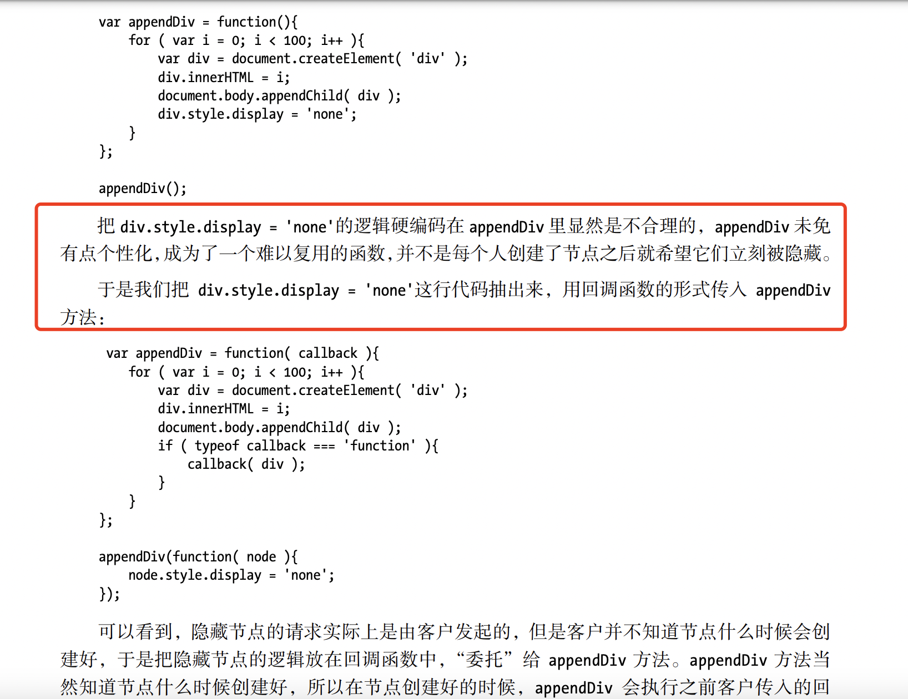
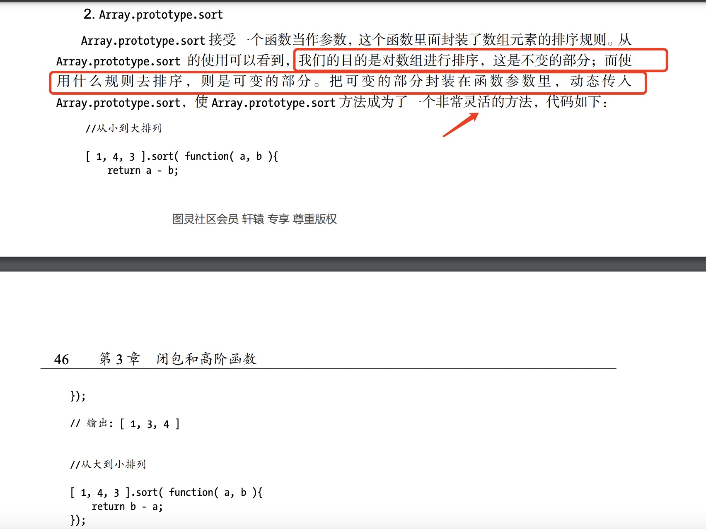

## 一 前言

### 1 什么是模式/ 什么是设计模式

1 “模式”最早诞生于建筑学。当时是在研究 处理同一个问题而设计出的不同建筑结构过程中，发现了那些高质量设计中的相似性==> 并用“模式”来指代 这种相似性

2 Erich Gamma、Richard Helm、Ralph Johnson、John Vlissides四人（人称Gang Of Four ，GoF）把这种“模式”观点, 应用于面向对象的软件设计中，并且总结了23种常见的 软件开发设计模式，录入《设计模式：可复用面向对象软件的基础》一书

3 设计模式 的书面定义是：在面向对象 软件设计过程中，针对特定问题的 简洁而优雅的解决方案

4 而通俗一点说：设计模式 是在某种场合下对 某个问题的 一种解决方案
  - 再通俗一点说，设计模式就是给 面向对象软件开发中的 一些好的设计取个名字
  - 统一命名本身就非常重要，有了命名才能被 简短明确地 应用、分享、传播


### 2 设计模式的目标/作用

1 设计模式的目标/作用：代码的 可复用性、可维护性高

2 核心原则：

，这给予了我们
> 2.1 划分程序中变与不变的地方==> 把不变的部分隔离出来，把可变的部分封装起来
  - 一个程序的设计总是可以分为 可变的部分和不变的部分；
  - 当我们找出可变的部分，并且把这些部分封装起来，那么剩下的就是不变和稳定的部分。这些不变和稳定的部分，通常就是可以 复用的部分

> 2.2 分辨模式的关键是【意图】 而不是结构
  - 有些设计模式的类图和结构 非常相似的，比如 代理模式/装饰者模式等；
  - 但是辨别模式的关键 是这个模式出现的场景，以及为我们解决了什么问题


## 二 基础知识

### 1 鸭子类型与多态

1 编程语言按照数据类型 可以分类为： 静态类型语言/ 动态类型语言

2 JS是 动态类型语言==> 没有类型检查==> 鸭子类型==> 
  > 只关注对象的行为，而不关注对象本身，也就是说关注 HAS-A, 而不是IS-A
  > 即所谓的 面向接口编程，而不是 面向实现编程

3 多态的思想：把 “做什么” 和 “谁去做以及怎么去做” 分离开来
  - 多态在静态语言中，可以用于通过类型检测==> 父类/超类==> 类的继承
  - 多态的最根本好处在于，让程序过程实现 只关心行为，不需要关心类型==> 从而消除关于类型判断的 条件分支

```js
// 修改前
var makeSound = function( animal ){ 
  if ( animal instanceof Duck ){ 
   console.log( '嘎嘎嘎' ); 
  }else if ( animal instanceof Chicken ){ 
   console.log( '咯咯咯' ); 
  } 
}; 
var Duck = function(){}; 
var Chicken = function(){}; 
makeSound( new Duck() ); // 嘎嘎嘎
makeSound( new Chicken() ); // 咯咯咯

// 修改后
// 不变的部分：做什么==> 所有动物都会发出叫声
// 以后再增加1种动物类型，也不用再修改makeSound函数内容
var makeSound = function( animal ){ 
 animal.sound(); 
};
// 变化的部分：谁去做以及怎么去做的实现细节==> 动物类型和sound细节
var Duck = function(){} 
Duck.prototype.sound = function(){ 
 console.log( '嘎嘎嘎' ); 
}; 
var Chicken = function(){} 
Chicken.prototype.sound = function(){ 
 console.log( '咯咯咯' ); 
}; 
makeSound( new Duck() ); // 嘎嘎嘎
makeSound( new Chicken() ); // 咯咯咯
```

### 2 高阶函数

1 封装变化的方法1：使用 回调函数解耦

例1: 

例2: 


2 封装变化的方法2：使用 AOP(面向切面编程)

S1 AOP的主要作用：把一些跟核心业务逻辑模块无关的功能抽离出来，比如日志统计、安全控制、异常处理等
  - 把这些功能抽离出来之后，再通过“动态织入”的方式掺入业务逻辑模块中==> 保持业务逻辑模块的纯净和高内聚性 + 可以很方便地复用日志统计等功能模块

S2 实现方法举例：装饰者模式

```js
Function.prototype.before = function( beforefn ){
  var __self = this;  // 保存原函数的引用
  return function(){  // 返回包含了原函数和新函数的 "代理"函数,记做A
    beforefn.apply( this, arguments );  // 执行新函数，修正this
    return __self.apply( this, arguments );  // 执行原函数
  }
};

Function.prototype.after = function( afterfn ){
  var __self = this;    // 这里的_self指向的是 上面的函数A
  return function(){
    var ret = __self.apply( this, arguments );
    afterfn.apply( this, arguments );
    return ret;
  }
};

var func = function(){
 console.log( 2 );
};

func = func.before(function(){
 console.log( 1 );
}).after(function(){
 console.log( 3 );
});


func();  // 1 2 3
```


## 三 设计模式之 单例模式

### 1 含义

1 含义：保证一个类仅有一个实例，并提供一个访问它的方法 ==> 有些对象我们只需要一个实例对象，如全局缓存、window对象等
> 而在JS中，单例模式的核心是 确保只有一个实例对象，并提供全局访问（也就是说并不一定需要创建class）

### 2 基本实现

1 实现思路：用一个变量标识 当前是否已经为某个类 创建过对象==> 如果是，则在下一次获取 类的实例时，直接返回之前创建的对象

2 代码实现：

```js
// 实现方式1
var CreateDiv = (function(){
  var instance;
  var CreateDiv = function( html ){
    if (instance){
      return instance;
    }
    this.html = html;
    this.init();  
    return instance = this;
  };

  CreateDiv.prototype.init = function(){
    var div = document.createElement( 'div' );
    div.innerHTML = this.html;
    document.body.appendChild( div );
  };
  // 立即执行函数的 返回值是一个函数
  return CreateDiv;
})();

var a = new CreateDiv( 'sven1' );
var b = new CreateDiv( 'sven2' );
alert ( a === b ); // true 

/**
 * 该实现方法的 缺点：
 * CreateDiv 的构造函数实际上负责了两件事情：
 *   - 第一是创建对象和执行初始化init方法，第二是保证只有一个对象，它违背了 “单一职责原则”
 *   - 假设我们要让这个类从单例类变成一个普通的可产生多个实例的类，那我们必须得改写 CreateDiv 构造函数，把控制创建唯一对象
 *     的那一段去掉，这种写法过于耦合
*/ 


// 实现方式2- 用代理实现单例模式

// S1 首先在CreateDiv构造函数中，把负责 管理单例的代码移除出去，使它成为一个普通的创建div的类：
var CreateDiv = function( html ){
  this.html = html;
  this.init();
};
CreateDiv.prototype.init = function(){
  var div = document.createElement( 'div' );
  div.innerHTML = this.html;
  document.body.appendChild( div );
}; 


// S2 接下来引入代理类 proxySingletonCreateDiv
// 利用代理类，把变的部分(创建div) 和不变的部分(创建和返回单例对象) 进行了拆分
var ProxySingletonCreateDiv = (function() {
  var instance;
  return function( html ) {
    if ( !instance ){
      instance = new CreateDiv( html );
    }
   return instance;
  }
})();

var a = new ProxySingletonCreateDiv( 'sven1' );
var b = new ProxySingletonCreateDiv( 'sven2' );
alert ( a === b ); 
```

### 3 惰性单例实现

1 惰性单例含义：在真正需要使用的时候才创建对象实例，而非在页面一加载完成就创建这个 实例对象

2 具体实现

```js
// 通用的惰性单例 实现思路
// S1 管理单例的逻辑其实是完全可以抽象出来的，它的逻辑始终是一样的

var getSingle = function( fn ){
  var result;
  return function(){
    return result || ( result = fn .apply(this, arguments ) );
  }
}; 

// S2 传入具体业务函数，如创建一个div元素
var createLoginLayer = function(){
  var div = document.createElement( 'div' );
  div.innerHTML = '我是登录浮窗';
  div.style.display = 'none';
  document.body.appendChild( div );
  return div;
};

// S3 创建div 单例对象
var createSingleLoginLayer = getSingle( createLoginLayer );

// 使用
document.getElementById( 'loginBtn' ).onclick = function(){
  var loginLayer = createSingleLoginLayer();
  loginLayer.style.display = 'block';
}; 
```

3 小结- 单例模式涉及内容
  - 代理模式/ 单一职责原则
  - 闭包/ 高阶函数


## 四 参考文档

[01 JavaScript设计模式与开发实践 第1-4章](/)